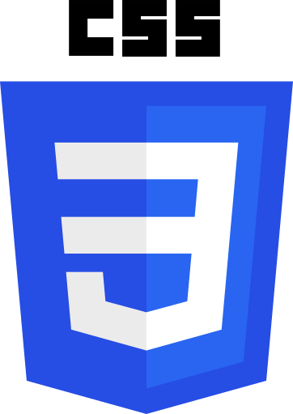
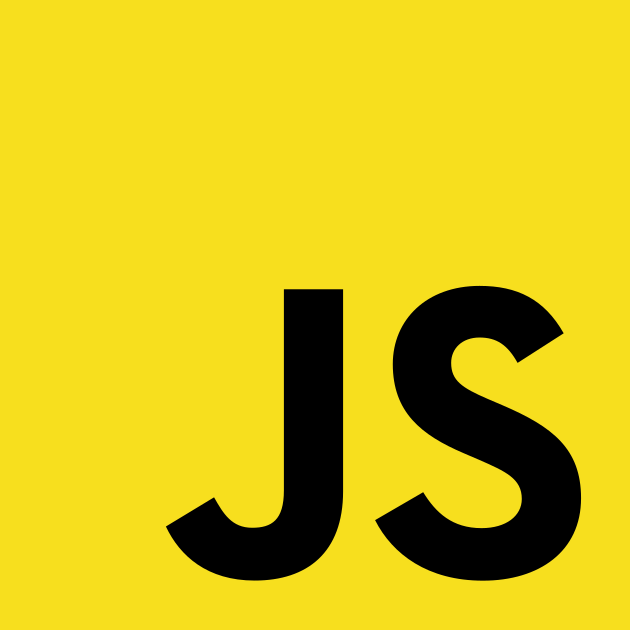
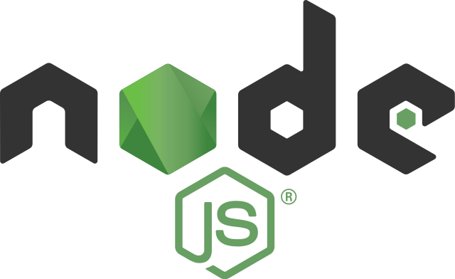
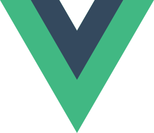
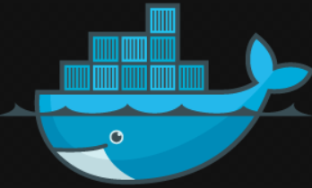
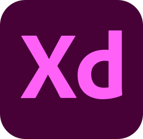
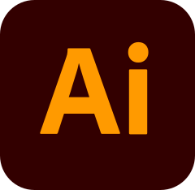
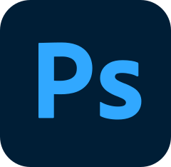
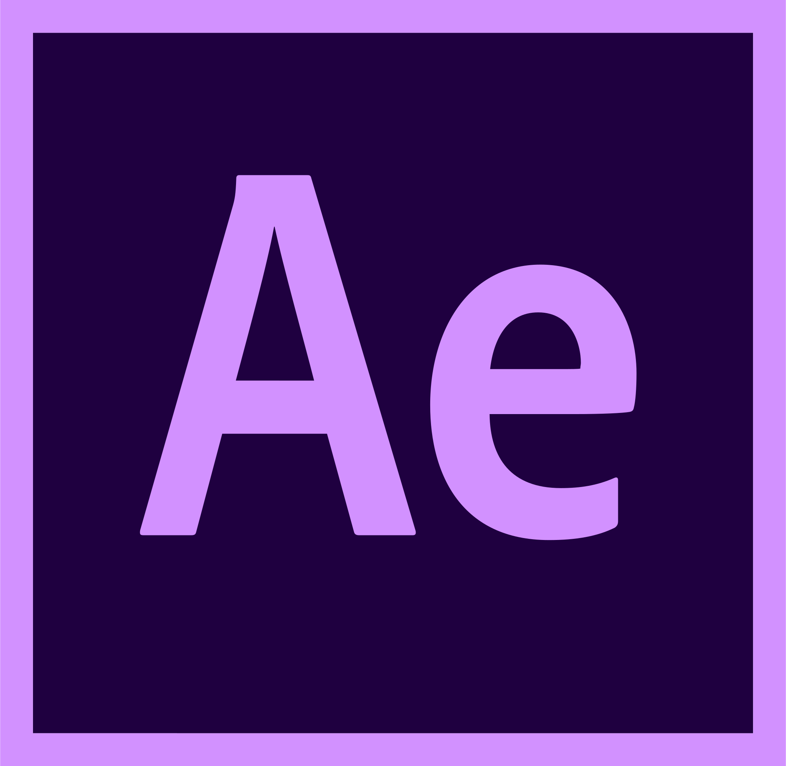
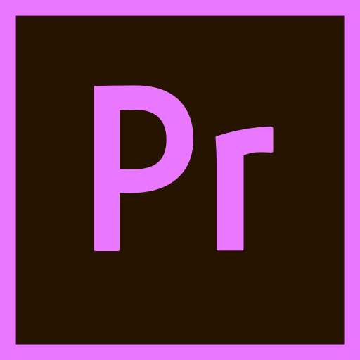

<h1 align="center">Hi, I'm Limerio and I'm a full stack developer. I'm using almost all the time for my projects, <a href="https://typescriptlang.org">Typescript</a></h1>

## _But I code more in backend than in Frontend_

---

__**About me :**__

- 👨‍🎓 I learn now [Docker](https://docker.com), [Kotlin](https://kotlinlang.org) and Adobe [XD](https://www.adobe.com/products/xd.html), [Illustrator](https://www.adobe.com/products/illustrator.html) for Web design
- 💻 I work for my own project [Runa](https://github.com/RunaBot)
- 🎞 I used for video editing software Adobe [After Effects](https://www.adobe.com/products/aftereffects.html), [Premiere Pro](https://www.adobe.com/products/premiere.html)
- 📷 I used for image editing software Adobe [Photoshop](https://www.adobe.com/products/photoshop.html)

---

__**Language, Framework, Database and Software used:**__

 
 

---

__**Contact me :**__

- Mail : <a href="mailto:limerio.pro@gmail.com">limerio.pro@gmail.com</a>

---

__**My Stats :**__

